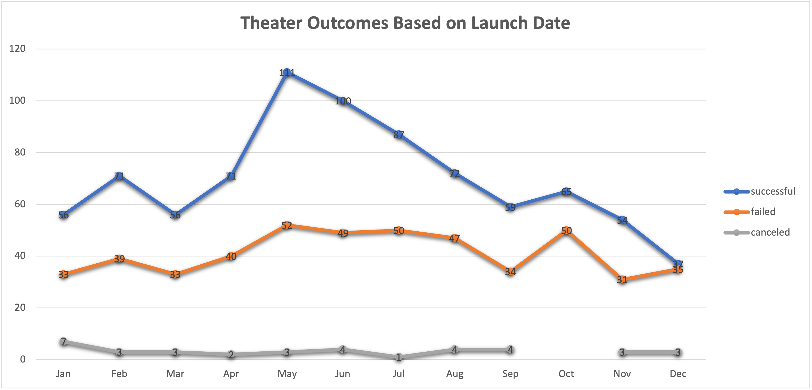
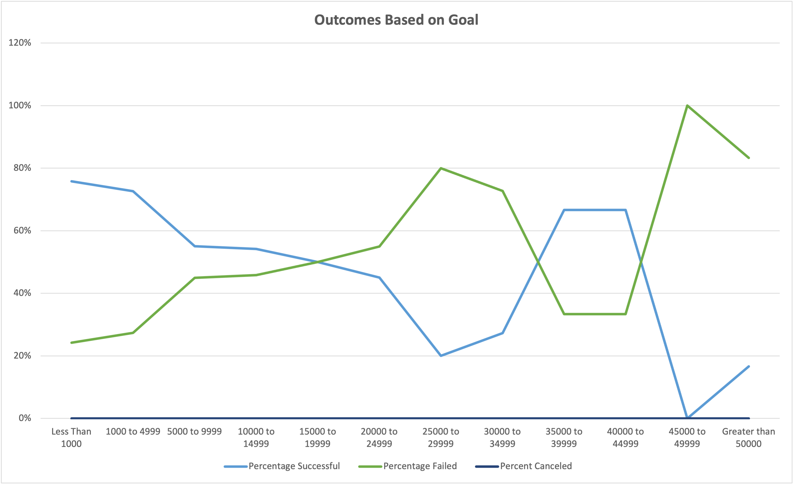

# Overview of project 
Performing analysis on Kickstarter data to compare Theater Outcomes VS Launch Date and Outcomes VS Goals using Excel. 
 would like to know different theater launch dates and fundraising goals impact campaign results. 
# Purpose
Analyze the campaigns outcomes based on launch date and goals in order to achieve the optimal fundraising result in the future.  

# Analysis and challenges 
Analysis of outcomes Based on Launch Date: A pivot table was constructed by selecting outcomes in columns and values, date created conversion in rows, and parent category and year in filter. Then I created a line chart to perform an analysis between the successful, failed, canceled theatre outcomes in different launch months. Possible challenge is selecting the right date in the pivot table.  
The number of successful outcome and Failure outcome for the theater is the highest during the month of May.  

Challenges Based on Launch Date: Possible challenges are selecting the right date in the pivot table.  

Analysis of Outcomes Based on Goals: A table was constructed to demonstrate the number and percentage of outcomes (successful, failed and cancelled) according to different goal. I performed the analysis by comparing the percentage of successful, failed and canceled rate to different fundraising goals. 
The successful rate and failure rate has an inverse relationship.  Sucess rate is the highest when the goal is less than $1000 and is the lowest when the goal is around $45,000 to $49,999.

Challenges of outcomes Based on Goals: A possible challenge is to correctly use the countifs function and selecting the right column.  

# Results
What are two conclusions you can draw about the Theater Outcomes by Launch Date?
1.Success and failure rate by launch date are moving at the same direction.
2.Theater outcome based on launch date has the highest successful rate and failure rate.
What can you conclude about the Outcomes based on Goals?
Higher dollar goals do not adversely impact success. 
What are some limitations of this dataset?
We are not sure that we are using a representative sample size since we are not sure of the population size.  
What are some other possible tables and/or graphs that we could create?
Other possible tables to look are the successful, failure, canceled rate by different country, currency and staff pick.  
